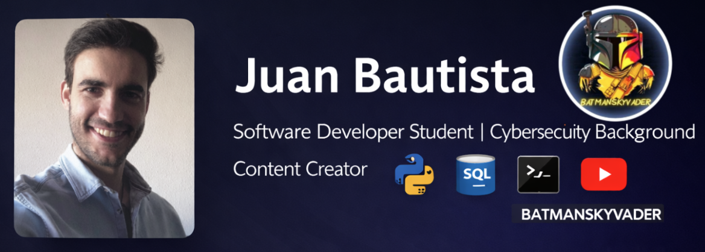

  

<h1 align="center">Juan Bautista</h1>

  Software Developer Student | Cybersecurity Background | Content Creator

 👋 Hi, I'm Juan Bautista

🎓 Software Development Student at Conquer Blocks  
💻 Currently learning and building with Python, SQL and Git  
🛡️ Background in Cybersecurity & Backup Solutions  
🎮 Content Creator on YouTube (13.2K subscribers)

---

## 🚀 About Me

I am currently studying at **Conquer Blocks**, developing strong foundations in software development and programming.

Completed courses in:
- Pseudocode & Programming Logic
- Python
- Terminal & Command Line
- SQL & Databases
- Control Panel & System Management

I also have professional experience working in **Cybersecurity and Backup solutions** as a Sales Representative, which gave me a strong understanding of IT infrastructure and data protection.

Outside of tech, I am a content creator on YouTube:
🎮 https://www.youtube.com/@BatmanSkyVader  
13.2K subscribers
